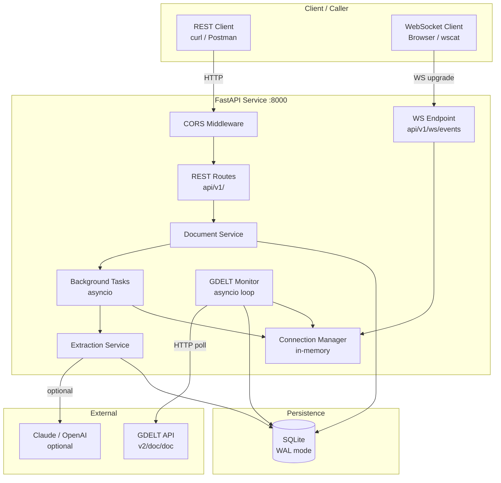
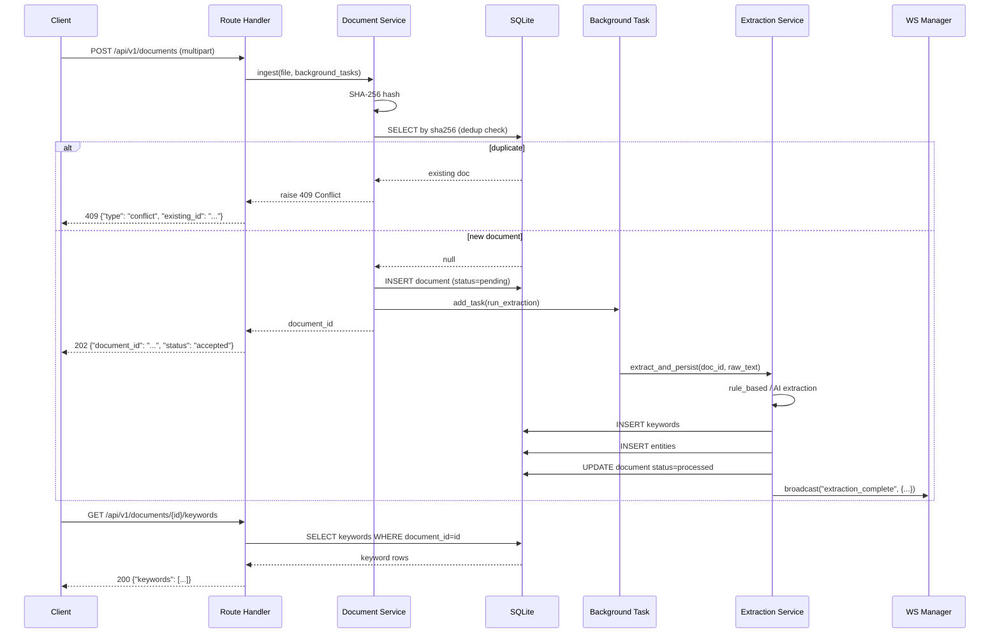
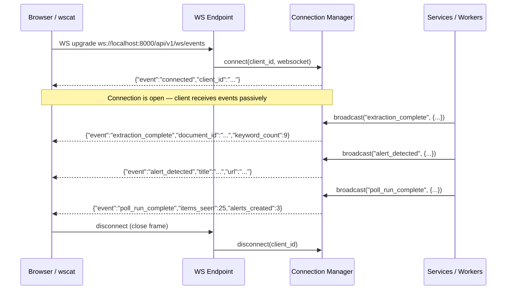
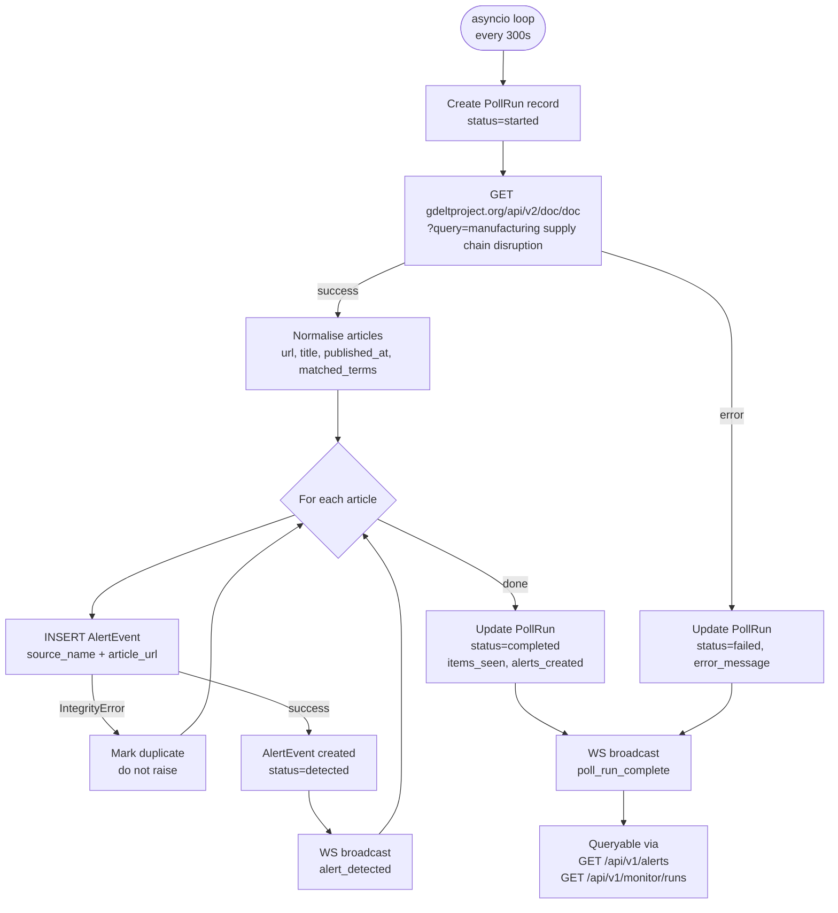

# Architecture Diagrams

All diagrams use Mermaid — render natively on GitHub and in most Markdown viewers.

---

## 1. System Architecture Overview

---

## 2. REST Data Flow — Document Upload & Extraction

---

## 3. WebSocket Data Flow

---

## 4. GDELT Polling & Monitoring Data Flow

---

## Deduplication Detail

The unique index `ux_alert_events_source_url ON alert_events(source_name, article_url)` is the single guard.

On duplicate insert:
1. SQLAlchemy raises `IntegrityError`
2. `alert_repo.insert_alert_event()` catches it, rolls back the savepoint
3. Returns `(alert, created=False)` — caller skips WS broadcast
4. No duplicate row exists in the DB

This makes the polling worker fully idempotent — re-running it any number of times on the same GDELT window produces the same DB state.
